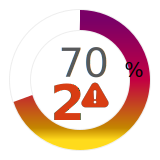
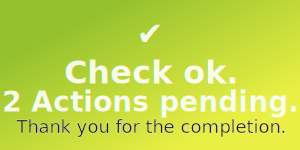

# pawa-svg-repo
Collection of SVG icons, thumbnails, defs and snippets created over time.

Expressions for data driven SVG images in Appsheet are included where available.

## Examples

### pawaMap Map Markers

... and many more

### Parent Progress and Number of children + Status

### Thumbnail Icon: Path on gradient rect

### Header Image: <tspan> 4 lines of text

